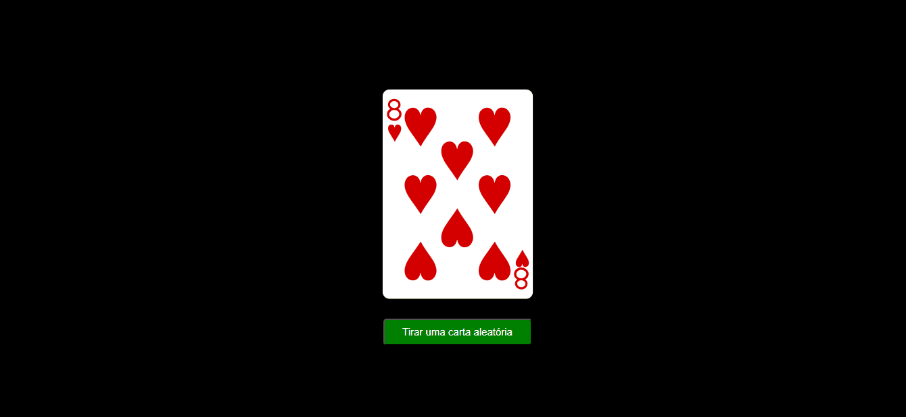

# Baralho
## Descrição
Fazer uma aquisição Get para a API usando o fetch. Um método que serve para trabalhar com APIs.
Page desenvolvida durante a aula de APIs. Onde deveriamos criar um baralho, e a cada clique no botão a carta deveria ser trocada por outra carta aleatória.

## Técnologias utilizadas
- HTML
- CSS
- JavaScript

## Page

